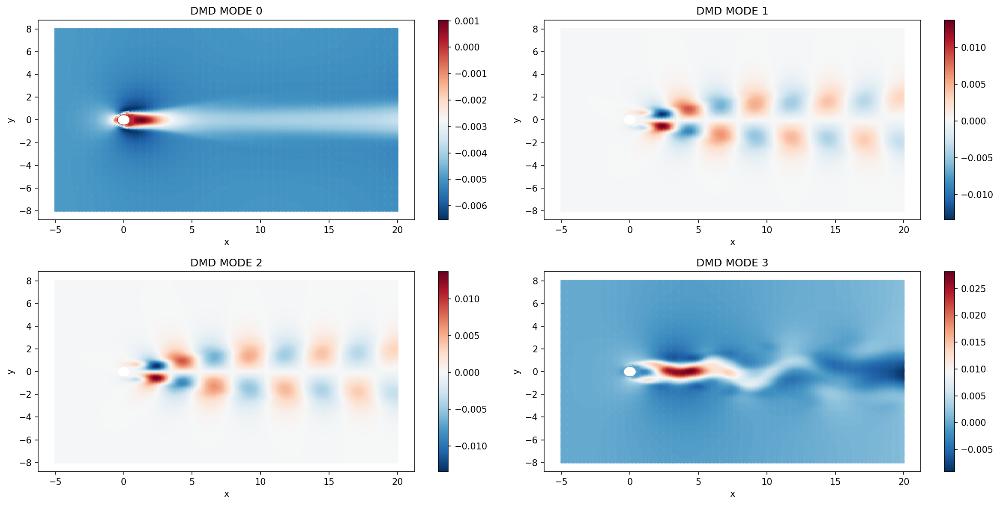
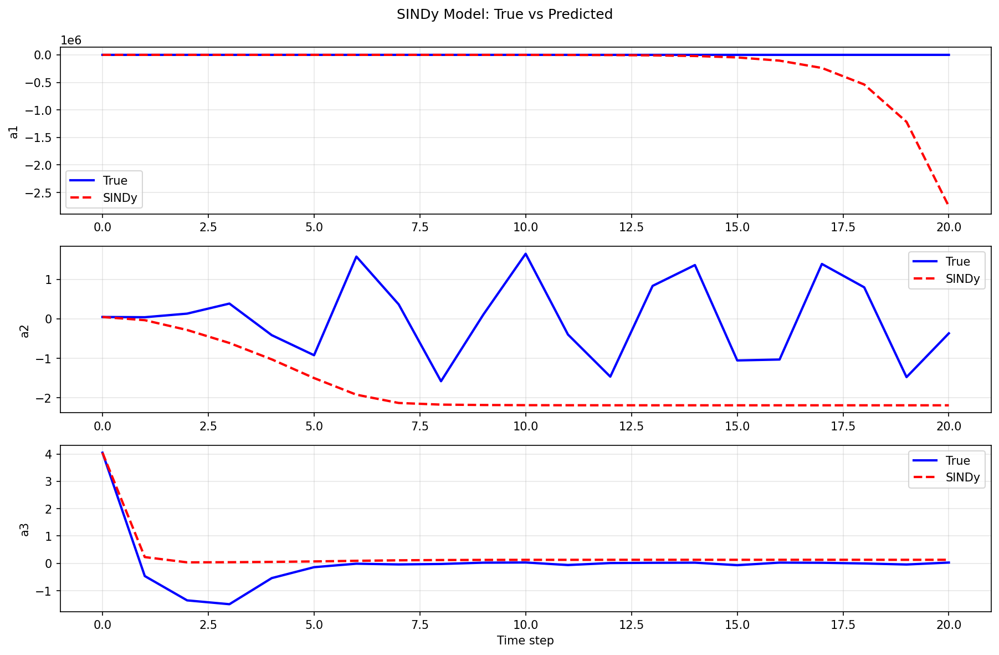

# SINDY-DMD ANALYSIS 

Attempt to analyze vortex shedding using SINDy and DMD model.  
Used OpenFOAM to extract snapshots of the simulation at different time intervals.

Here are the plots of different analysis:

DMD which stands for Dynamic Mode Decomposition, is a process of findinf out the patterns which mostly describe the flow of the fluid. As most of the behaviour can be reconstructed by those patterns which seems to appear everywhere and others are just mixture of those. And as the result we are left with few things to take care of, instead of thousands and thousands of data's. 

So the sindy plot is not correct a1 and a3 are almost aligned with the true values, but a2 is not. There are several reasons for this:
1. We have to account for energy convservation 
2. We have to design a custom optimization process where the various constraints are taken into consideration.

So how sindy works is that it tries to learn the underlying equations that govern the flow from the data. It mainly learns three equations which are POD1, POD2 and the shift. Its proven that only these 3 equations are required to explain the behaviour of the flow. 

